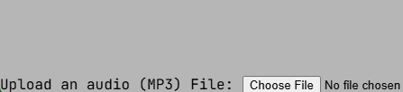

# Audio Player 3000

Welcome to the Audio Player 3000, a place to play all sorts of audios that you want, straight from your phone or computer! 🎶

## Features
* Upload Audio Feature 👍
* Play or pause audio ▶️
* Speed or slow audio 🏃‍♂️‍➡️

## Getting Started
### Dependencies
* None

### Installing
* Any IDE

### Executing
* Live Server Extension

## How to use the Audio Player

First, you need to upload an **mp3** file through the upload audio button seen at the bottom of your screen (See Figure 1)

  

<small>Figure 1: Upload your file by clicking the button</small>

Then, within you files app, go to wherever the desired sound you wish to play is located.
 
 

<small>Figure 2: Example place where audio files are stored. Yours can be anywhere, so making a dedicated folder for audio is a good choice.</small> 

Choose an audio file and upload it.
 

<small>Figure 3:  Choose an available mp3 file</small> 

The uploaded sound will how next to the upload button and will start playing in the background.
 
  
<small>Figure 4:  Uploaded Song shows here</small> 
